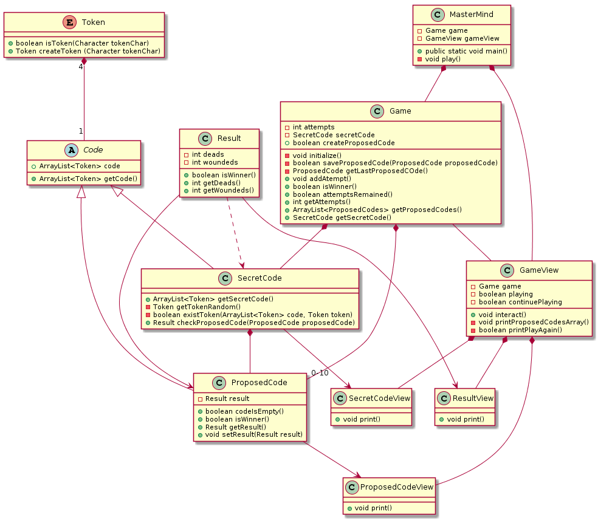

= Memoria MasterMind IWVG

Esta práctica consiste en la realización de un simulador del famoso juego MasterMind
desde una primera versión muy básicas con numerosos errores hasta una versión final depurada
a partir de los conocimientos obtenidos en esta asignatura.

== Primera iteración

=== Introducción

En esta primera versión se ha realizado un MasterMind con tres clases Java y un enumerador Token.
Es una versión funcional en la que el usuario por consola pasa los códigos y el emulador le da una
respuesta a ese código.

=== Diseño

Como se puede ver en la Figura 1, tenemos un enumerador Token que se refiere a una ficha y una clase
TokenManager que contiene todas las funciones correspondientes a la gestión de fichas. Se ha desarrollado
la clase MasterMind que sería el tablero, que contiene todas las fichas, los intentos, el código
y los aciertos de cada intento. Por último, tenemos la clase Console que es la clase donde se ejecuta
el programa.

=== Aspectos a mejorar

En primer lugar, vemos que nuestra programación no ha sido totalmente orientada a objetos ni
se ha realizado un análisis del modelo del dominio, por tanto, existen clases que en el dominio del MasterMind
no tienen cabida. Para mejorar esto, hemos realizado un análisis del dominio llegando a la conclusión de que
es necesario crear una clase Code referida a la combinación de colores de cada partida. De esta clase
Code heredara la clase ProposedCode que se refiere a la combinación de colores elegida por el jugador
en cada turno y también heredara la clase SecretCode que se refiere al código secreto de cada partida.

Además, las muertes y heridos se guardan en dos parámetros dentro de la clase MasterMind cuando en realidad
estos datos se podrían guardar dentro de una clase Result que le diga al cliente si el usuario ha ganado o no.

Por otro lado, MasterMind era anteriormente una clase que se encargaba de gestionar todo el juego, con estos cambios
MasterMind tendrá relaciones de asociación con los distintos objetos, en lugar de llevar ella todo el trabajo.
De esta manera hacemos una división de responsabilidades, en lugar de que la clase MasterMind lleve el gran peso de
nuestro programa.

Para que nuestro código sea más sencillo; eliminamos el método que reinicia el MasterMind puesto que es un
método estático sin parámetros. Además, cambiamos el nombre del método "checkAttempt" puesto que en realidad este
método chequea, pero además almacena, por tanto el nombre no es correcto y puede llevar a error.

Con respecto a la relaciones, en la primera versión teniamos relaciones de composición entre el enumerado Token
y la clase TokenManager, la cual se encargaba de toda la gestión del enumerado. La clase TokenManager tenía
una relación de composición con la clase MasterMind, ya que MasterMind le pedía datos constantemente
a la clase TokenManager.

Por último, vemos innecesaria una clase solamente para el método main, el cual podría incluirse dentro de la
clase MasterMind.

=== Calidad del Software

Con respecto a los diferentes parámetros que definen la Calidad del Software vemos necesarias estas
mejoras en los siguientes parámetros.

==== Seguridad

Nos vemos en la necesidad de comprobar para diversas funciones que los parámetros recibidos son
correctos y no se han recibido parámetros indebidos, cosa que en esta primera versión no se ha hecho. Nos
aseguramos de que cada clase modifique y gestione solamente sus datos y no haya clases "cotillas"
que hagan el trabajo que deberían hacer otras clases. Como nuestro MasterMind, que hacia trabajo que
realmente le correspondía a otras clases.

==== Portabilidad

Adaptamos el código para que los datos puedan usarse tanto en una interfaz gráfica como en la consola,
o en posibles interfaces futuras.

=== Mantenibilidad

Con respecto a los diferentes parámetros que definen la mantenibilidad del Software vemos necesario las
siguientes mejoras en los diferentes parámetros.

===== Viscosidad

Existen nombres de métodos en esta versión que pueden ser confusos, ya que no se distinguen entre
los Tokens referidos a las fichas de colores y los Tokens referidos a las fichas de aciertos (blancas y rojas).
Por tanto, se ha cambiado el nombre del método getAttemptsTokens que devuelve la lista de todos
los aciertos de cada turno y las fichas de acierto serán una clase aparte llamada Result.

Por otro lado, existen diversos "while" que se ejecutan en el método Main con variables que están
nombradas de manera incorrecta o no tan clara como podría definirse.

===== Rigidez

Nada destacable.

===== Fragilidad

Para mejorar la fragilidad del código, convertir en constantes aquellos "números mágicos" que aparecen
en el código, por ejemplo aquellos números referidos a la cantidad de fichas en cada combinación (
podría ser 5 en lugar de 4, o 3 ).

===== Inmovilidad

Buscamos que sea reusable en el futuro. Por tanto nos adaptamos a los estandares de Java. Existe la función
checkAttempt() que devuelve un entero según el estado. En caso de error devolvemos el entero 1 o 2,
cuando por estandar se debería devolver -1 en caso de error.

=== Legibilidad

Nuestro código tiene violaciones de la legibilidad:

* Existen nombres en las variables que pueden ser confusos o que no representan fielmente a esa variable en sí
o pueden ser confusas y/o no comprensibles.

* Nos fijamos en que todas las variables, clases y métodos que se refieran a lo mismo o tengan una funcionalidad
semejante se definan los mismos nombres

* No se han cumplido los estándares de la industria en algunos casos, como en el retorno del método
checkAttempts() que en caso de error no retorna -1, sino 1.

== Segunda iteración

=== Introducción

En esta segunda iteración se ha realizado un MasterMind con siete clases Java, siendo una de ellas un enumerador.
Sigue siendo versión funcional en la que el usuario por consola pasa los códigos y el emulador le da una
respuesta a ese código.

=== Diseño

Como se puede ver en la Figura 2, tenemos un enumerador Token que se refiere a una ficha. La clase Code se refiere
a cada código de cuatro fichas, y de esta clase heredan dos clases ProposedCode y SecretCode. La clase
ProposedCode se refiere a un código propuesto y tiene un resultado. Esta clase se encarga de crear un código
a partir de la información enviada por el usuario es válido y de almacenar un objeto de la clase Result que contiene
los muertos y heridos de ese código propuesto. La clase SecretCode es el código secreto que el usuario tiene
que adivinar. Esta clase comprueba el String enviado por el usuario y retorna la comparación entre el código
propuesto y el código secreto. Además, almacena en un array de ProposedCode todos los códigos que han sido
propuestos en la partida.

Las clases SecretCode, ProposedCode y Result componen el MasterMind. La clase MasterMind es la encargada de
empezar la partida y de interactuar con el usuario. Almacena los intentos del usuario y el código secreto, y
se encarga de solicitar al código secreto que compruebe el String enviado por el usuario. En definitiva, lleva a
cabo el control de la partida.

=== Aspectos a mejorar

Existen clases que realizan operaciones de las cuales no son responsables, por tanto la responsabilidad aún puede
mejorarse. Nuestro MasterMind dista mucho de tener un diseño modular, por tanto tenemos que mejorar el diseño para
hacerlo modular. Para ello, necesitamos:

* Alta cohesión. Nuestro código no tiene alta cohesión en este momento, existen métodos como checkAndSaveProposedCode()
de la clase SecretCode que tiene dos responsabilidades, por tanto, tenemos que hacer que este método solo tenga
una responsabilidad, o chequear el código propuesto o almacenarlo.

* Bajo acoplamiento. De momento nuestro código, al no tener muchas clases, no tiene problemas de acoplamiento. La clase
que tiene más clases dependientes es MasterMind con tres.

* Tamaño pequeño. Tenemos que chequear todas nuestras clases, métodos y paquetes para que no superen las métricas definidas
como aceptables. Por ejemplo, el método Main tiene más de 25 líneas de código, por tanto es mejorable.

Existen numerables ejemplos de Programación Defensiva en nuestro código que tenemos que eliminar, usando asserts en
su lugar. De esta forma, gestionamos las precondiciones y las postcondiciones de cada método. Hemos aplicado esto en todo
nuestro código excepto en la entrada del usuario.

Se deben realizar una distribución de las responsabilidades de forma equilibrada en lugar de tener clases de Datos
sin responsabilidad y que su responsabilidad sea realizada por otra clase que realiza trabajo de más.
En nuestra segunda versión, la clase MasterMind y la clase SecretCode realizaban casi todo
el trabajo, mientras que ahora cada clase se encarga de hacer su parte, evitando así clases
"cotillas", que mediante "gets" realizan operaciones que no le corresponden.

==== Principio de menor compromiso

Se deben crear interfaces que proporcionen el comportamiento esencial. Por tanto se necesita una vista de la clase Result,
una vista de la clase ProposedCode, una vista de la clase SecretCode y una vista del enumerado Token. Todo esto
irá integrado en una clase GameView, mientras que los datos irán integrados en una clase Game. Las vistas deben estar
asociadas a una partida. De esta forma, todos las operaciones relacionadas con la ejecución por
consola se realizarán dentro de las clases View, y en las clases de datos solo se realizarán
operaciones con los datos.

==== Principio de única responsabilidad

Este principio nos dice que una clase debería tener solo un único mótivo de cambio. En nuestro caso, la clase MasterMind
cambiaría si se cambia la interfaz de usuario, y además es responsable de la ejecución del juego. Por tanto, tiene
dos motivos de cambio y debe ser modificada. Por tanto, partimos la clase, creando una clase para la interfaz de
usuario y otra clase para la ejecución. Este es otro motivo por el que se deben crear clases vista
de todas las clases de datos que tenemos actualmente.

==== Clases de Datos

Existen clases de datos que solo tienen métodos Get/Set sin ninguna otra responsabilidad, son clases que necesitan
adquirir alguna responsabilidad.

==== Principio de Demeter

No se debe enviar nunca a otros objetos indirectos obtenidos como resultado de un mensaje a un objeto de conocimiento
directo. Este caso era muy común en nuestro cógido y por tanto, hemos intentado evitar tratar
con un objeto que ha sido pedido mediante método Get.

== Tercera iteración

=== Introducción

En esta iteración tenemos ya un código modular en el que tenemos clases de datos que realizan
todas las operaciones y clases vista que se encargan de mostrar estos datos al usuario por
consola. Las clases de datos no tienen ningún tipo de dependencia de las clases vista.
Además, Hemos asignado a cada clase la responsabilidad que consideramos que debería tener
según nuestro diseño. Vuelve a ser una iteración totalmente funcional.

=== Diseño

Como podemos ver en la Figura 3, tenemos 13 clases Java, separando los datos de la vista. Las
clase MasterMind vuelve a ser la clase principal y a partir de la cual se ejecuta nuestro
programa. Las clases vista estan gestionadas desde la clase GameView con relaciones de
composición. Lo mismo pasa con lasa clases de datos y la clase Game, la cual esta
compuesta del resto de clases de datos. Para asignarle a cada clase sus responsabilidades
todas las clses vista tienen al menos, la responsabilidad de mostrarse por pantalla
de manera correcta mediante un método "print()". Existen dos clases de datos que no tienen
una clase  equivalente vista. Una de ellas es la clase Code, ya que esta clase la hemos considerado clase abstracta
debido que no creamos objetos de esta clase, sino que es una clase padre de SecretCode
y ProposedCode. La otra es el enumerador Token, el cual simplemente no es necesario tener
una clase vista puesto que al ser simplemente un caracter no es necesario tratarlo de ninguna
forma especial para mostrarlo por pantalla.

Hemos considerado algunos cambios en el diseño con respecto a las iteraciones anteriores
debido a que cuadran mejor con nuestra idea del juego MasterMind. Ahora, el conjunto de
códigos propuestos lo almacena la clase Game en lugar de almacenarlo la clase
SecretCode como haciamos anteriormente, ya que no considerabamos que gestionar
los códigos propuestos fuera trabajo del código secreto. La responsabilidad de esta clase
es decir el resultado de ese código propuesto, pero no almacenarlo. Otro cambio realizado
ha sido el de asignarle al enumerado Token la responsabilidad de comprobar si un
caracter cualquiera es un Token y la de crear un Token a partir de un caracter,
responsabilidades anteriormente asignadas a la clase ProposedCode lo cual no lo veíamos
totalmente apropiado.

En cuanto al cambios de responsabilidades, el encargado de decir ahora si una combinación
propuesta es o no ganadora es la clase Result, algo que debería haber sido desde el
princpio, en lugar de que la clase SecretCode pida el objeto para ver si es o no ganador.
Cambios como este han sido muy comunes en la nueva versión del MasterMind.

En lo referido a relaciones, entre las clases vista y datos hay una relación de asociación, mientras
que entre las clases de datos y Game hay una relación de composición, igual pasa con las clases
vista y la clase GameView. La clase MasterMind esta compuesta de la clase de datos Game
y de la clase de vistas GameView. Además, hay una relación de asociación entre las clases
Game y GameView. Por otro lado SecretCode tiene una relación de uso con Result y una relación de asociación
con ProposedCode. Existe una clase de herencia entre la clase Code y las clases SecretCode y ProposedCode.
Esta clase Code se relaciona también con el enumerado Token con una relación de composición.

Por último, hemos disminuido el tamaño de las clases y/o métodos que teniamos más grandes
dividiendolos en funciones o asignando responsabilidades a otras clases. Es el caso de
GameView, que es nuestro método más grande pero ya no tiene más de 25 líneas de código.
